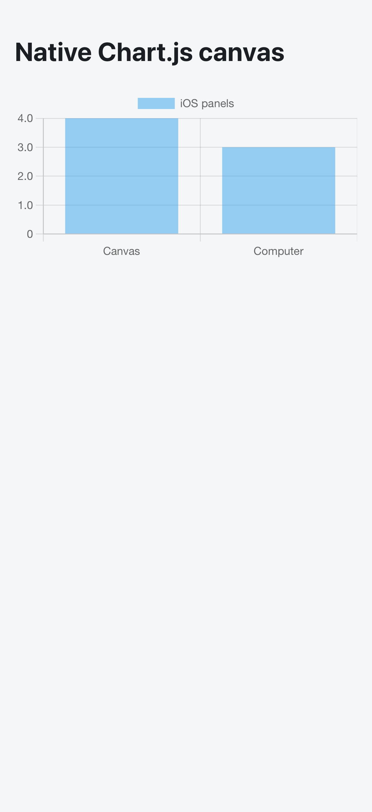

# iOS canvases and computers

Build the bundled iOS web assets with `npm run build:ios`, then run `npx cap sync ios`.
Xcode Cloud and `npm run ios:phone` use this build automatically.
The app reads `capacitor://localhost/config.json` from its bundle on each launch, before mounting the router.
It does not fetch the web deployment's configuration.

`config.mindroom.ios.json` overlays the ordinary `config.mindroom.json` for this hosted iOS build.
It enables canvases and jsDelivr npm libraries; computers remain disabled until a compatible service is deployed.
Only agents managed by the configured computer service can open computers there.
After deploying [the native-origin backend change](https://github.com/mindroom-ai/mindroom/pull/2680) and updating its allowlist, set `MINDROOM_IOS_COMPUTER_API_URL=https://mindroom.lab.mindroom.chat` in the build environment to enable the lab service.
The hosted Matrix/provisioning origin has no computers endpoint; the lab service currently rejects native origins.
For Xcode Cloud, set the variable in the workflow environment before building.
Operators can select another compatible service with this variable, or disable computers by setting it to an empty string.
Change the overlay's canvas switches to disable canvases or library loading.
Ordinary web builds retain their existing defaults and runtime deployment switches.

The computer runtime must support the bundled native origin and explicitly include `"capacitor://localhost"` in `MINDROOM_COMPUTER_ALLOWED_ORIGINS`, alongside its trusted web origins.
Matrix OpenID authenticates the viewer; bearer credentials authorize REST calls and single-use stream tickets authorize noVNC over WSS.
Cookies, embedded remote pages, WebRTC, and additional App Transport Security exceptions are unnecessary.
See [the computer deployment guide](https://docs.mindroom.chat/tools/worker-computer/) for worker prerequisites.

Canvases retain their opaque sandbox, restrictive CSP, and two-frame navigation containment.
Library loading permits only `https://cdn.jsdelivr.net/npm/` scripts, styles, and fonts.
Phones use the existing full-screen panel, including safe-area padding and a close button; the hidden canvas conversation is unmounted.
The native bridge checks WebKit's frame metadata before plugin/Cordova messages or synchronous cookie/HTTP prompts, and Capacitor injects bridge scripts only into the main frame.
Android also requires its frame-aware bridge; legacy bridge fallbacks and synchronous interfaces are disabled, with SystemBars viewport handling invoked from a native page-commit callback.

Run `bash scripts/test-ios-routing.sh` for simulator bridge security and native routing tests.
The native suite renders the production canvas documents under the app frame policy and retains a screenshot after Chart.js paints from the allowed npm source.
The security tests check actual plugin side effects and cookie mutation from both ordinary and opaque sandboxed subframes, with working main-frame controls.
The native origin test records a real WebKit OPTIONS preflight and bearer-header GET against a disposable loopback API using the shipping transport settings.
No acceptance code, test plugins, or test fixtures enter the shipping app.

The [simulator CI run](https://github.com/mindroom-ai/mindroom-chat/actions/runs/37243530319) passed all 25 routing/security tests and retained this screenshot of the production canvas document loading Chart.js from jsDelivr.
This checks the native canvas document and bridge; full application version switching, sending errors to an agent, and controlling a deployed computer still require app acceptance verification.

