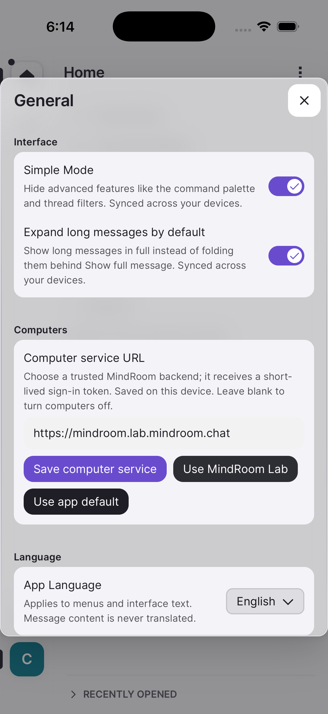
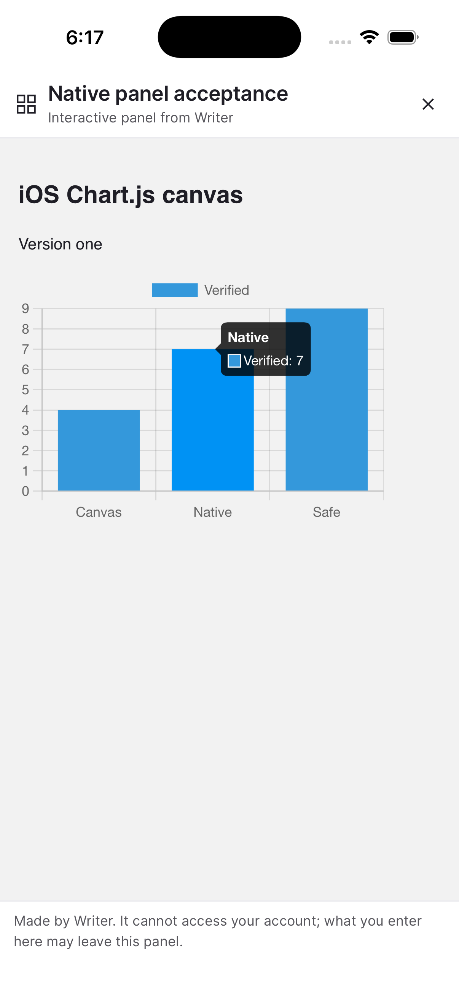
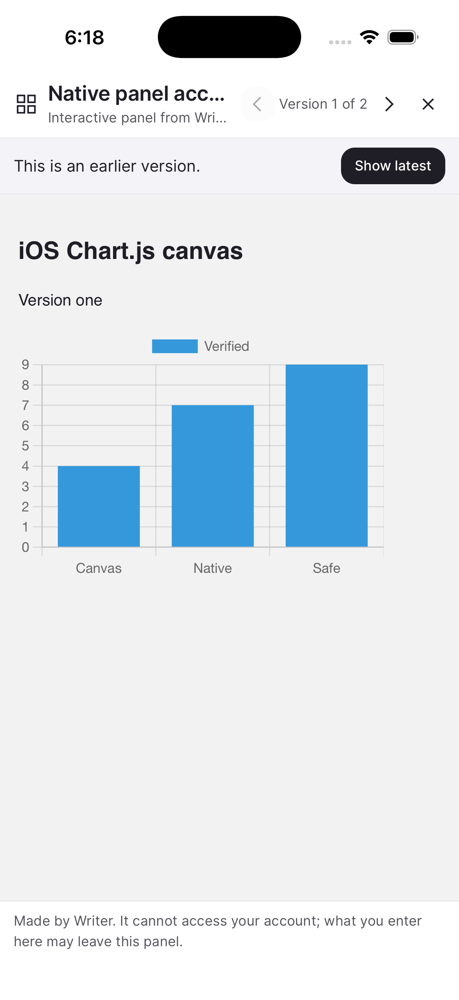
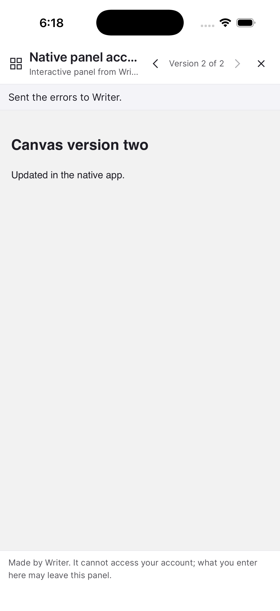
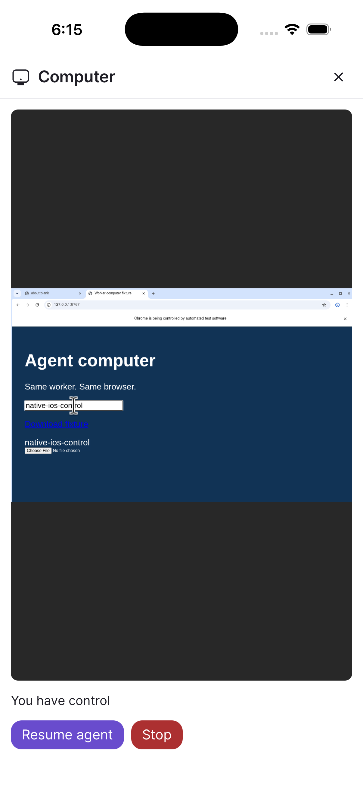
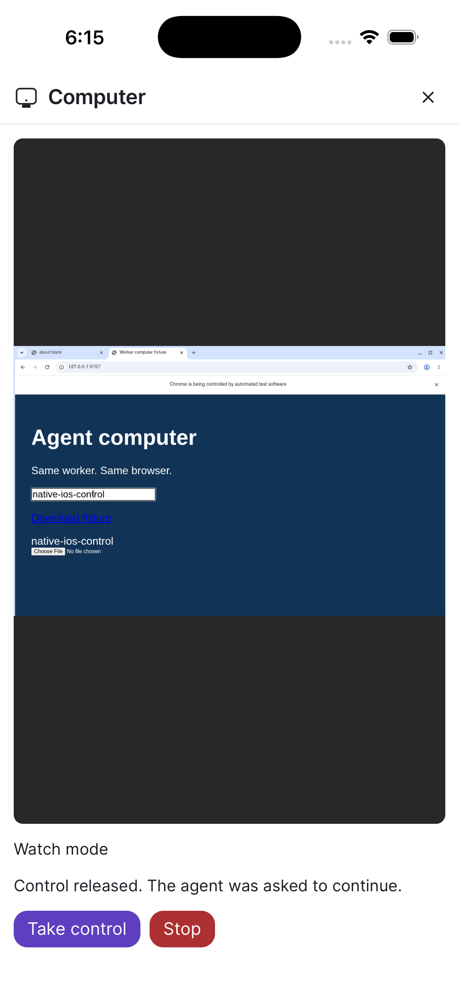

# iOS canvases and computers

Build the bundled iOS web assets with `npm run build:ios`, then run `npx cap sync ios`.
Xcode Cloud and `npm run ios:phone` use this build automatically.
The app reads `capacitor://localhost/config.json` from its bundle on each launch, before mounting the router.
It does not fetch the web deployment's configuration.

`config.mindroom.ios.json` overlays the ordinary `config.mindroom.json` for this hosted iOS build.
It enables canvases and jsDelivr npm libraries; computers remain disabled until a service is configured.
Only agents managed by the configured computer service can open computers there.
In **Settings → General → Computers**, choose **Use MindRoom Lab**, then **Save computer service**, or enter the origin of another trusted compatible backend.
HTTP is also accepted for localhost, literal private IPv4 addresses (`10.0.0.0/8`, `172.16.0.0/12`, `192.168.0.0/16`), and IPv6 unique-local addresses (`fc00::/7`).
The form shows an unencrypted-traffic notice before saving an HTTP service; use it only on a trusted local network.
Public addresses and DNS names, including `.local` names, still require HTTPS.
On a physical iPhone, localhost refers to the phone; use your server’s LAN IP and port, such as `http://192.168.1.50:8765`, to reach another machine.
HTTPS-hosted web clients may still block HTTP services through their browser’s mixed-content policy.
The setting is stored only on this device and persists across launches; it does not sync through Matrix account data.
The chosen backend receives a short-lived Matrix OpenID sign-in token, never the Matrix access token.
Save a blank URL to disable computers, or choose **Use app default** to restore deployment configuration.
Changing the service closes the existing computer session and clears its control state.
Lab usage requires deployment of [the native-origin backend change](https://github.com/mindroom-ai/mindroom/pull/2680) and an updated allowlist.
Operators can optionally set `MINDROOM_IOS_COMPUTER_API_URL=https://mindroom.lab.mindroom.chat` in the build environment after rollout to make it the app default.
The hosted Matrix/provisioning origin has no computers endpoint; the lab service currently rejects native origins.
For Xcode Cloud, set the variable in the workflow environment before building.
Operators can select another compatible service with this variable, or disable computers by setting it to an empty string.
Change the overlay's canvas switches to disable canvases or library loading.
Ordinary web builds retain their existing defaults and runtime deployment switches.

The computer runtime must support the bundled native origin and explicitly include `"capacitor://localhost"` in `MINDROOM_COMPUTER_ALLOWED_ORIGINS`, alongside its trusted web origins.
Matrix OpenID authenticates the viewer; bearer credentials authorize REST calls and single-use stream tickets authorize noVNC over WSS (WS for a local HTTP service).
Cookies, embedded remote pages, WebRTC, and additional App Transport Security exceptions are unnecessary.
See [the computer deployment guide](https://docs.mindroom.chat/tools/worker-computer/) for worker prerequisites.

Canvases retain their opaque sandbox, restrictive CSP, and two-frame navigation containment.
Library loading permits only `https://cdn.jsdelivr.net/npm/` scripts, styles, and fonts.
Phones use the existing full-screen panel, including safe-area padding and a close button; the hidden canvas conversation is unmounted.
Long canvas titles shrink while the version controls and close button keep their full width, verified at a 320px viewport.
The native bridge checks WebKit's frame metadata before plugin/Cordova messages or synchronous cookie/HTTP prompts, and Capacitor injects bridge scripts only into the main frame.
Android also requires its frame-aware bridge; legacy bridge fallbacks and synchronous interfaces are disabled, with SystemBars viewport handling invoked from a native page-commit callback.

Run `bash scripts/test-ios-routing.sh` for simulator bridge security and native routing tests.
The native suite renders the production canvas documents under the app frame policy and retains a screenshot after Chart.js paints from the allowed npm source.
The security tests check actual plugin side effects and cookie mutation from both ordinary and opaque sandboxed subframes, with working main-frame controls.
The native origin test records a real WebKit OPTIONS preflight and bearer-header GET against a disposable loopback API using the shipping transport settings.
No acceptance code, test plugins, or test fixtures enter the shipping app.

The [simulator CI run](https://github.com/mindroom-ai/mindroom-chat/actions/runs/37250210887) built the shipping app and passed all 26 routing/security/origin tests.
It uploads an unsigned arm64 simulator app as `ios-simulator-app`, plus the native XCTest result and logs as `ios-routing-results`.

Full application acceptance used that app on a disposable iPhone 17 Pro simulator running iOS 26.2.
Only the downloaded test artifact's Matrix/UI-action configuration was changed to select disposable fixtures; the bundled computer default stayed empty.
The compatible loopback computer service, running the backend PR with an explicit native-origin allowlist, was selected through the app's Settings.
The saved service persisted through installation and relaunch of the final CI app.
Credentials were seeded into simulator app data, never the bundle or repository.
Chart.js loaded from the real allowed jsDelivr npm URL, rendered, and responded to a tap.
A Matrix edit offered **Load update**, loaded version two, and the version control returned to the original Chart.js page.
**Tell Writer** sent the canvas error, with its agent mention and originating thread verified on Matrix.
The computer displayed the real worker browser, accepted **Take control**, received `native-ios-control` through the simulator keyboard, and returned to Watch mode with **Resume agent**.
The agent's browser snapshot and input readback both contained that value.

